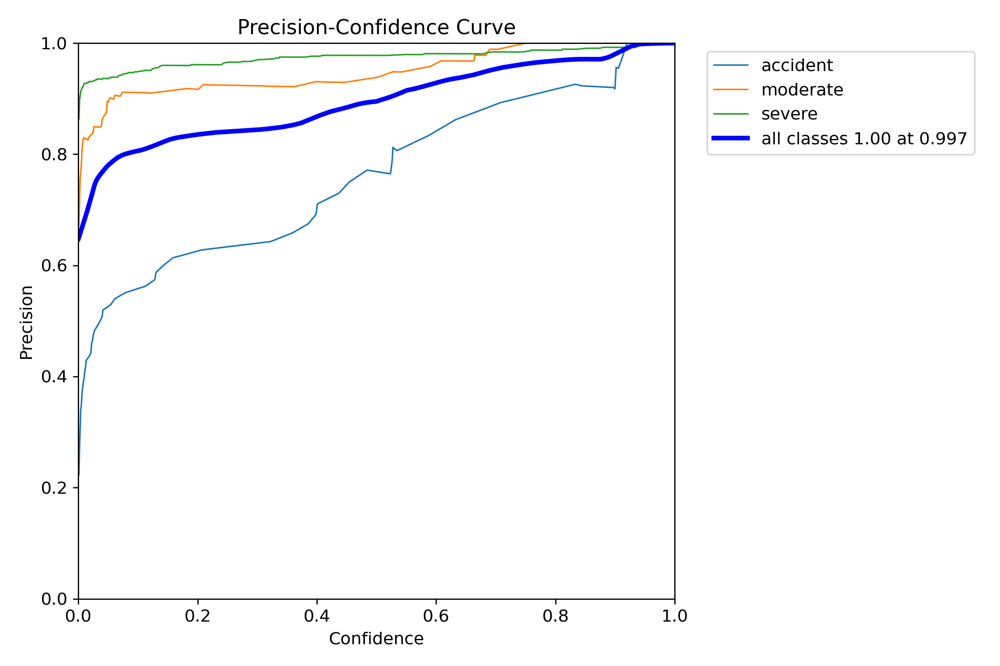
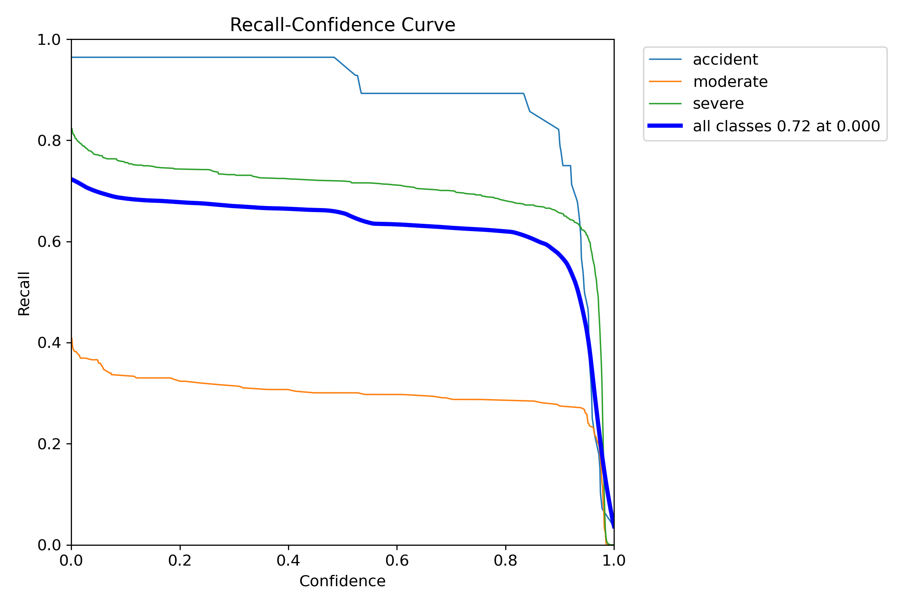
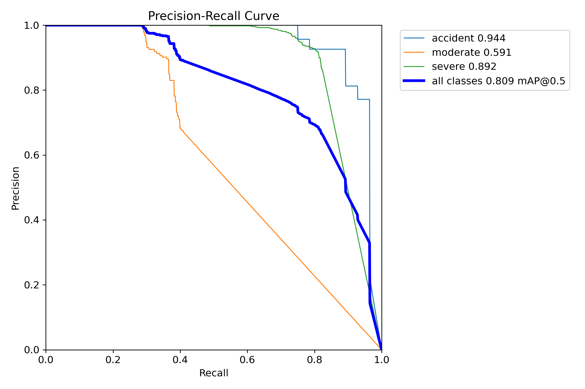
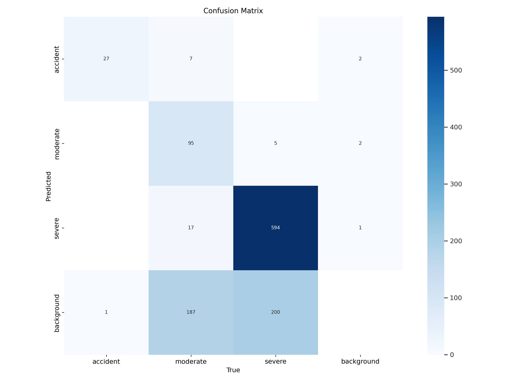
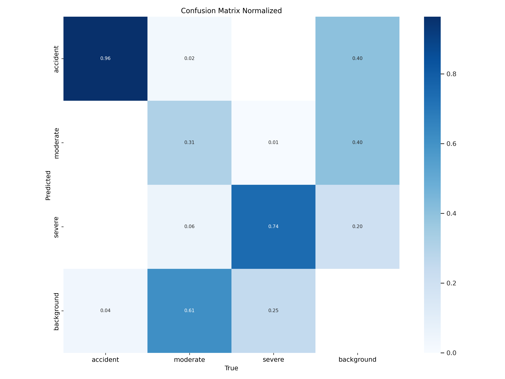

# YOLO-Based Accident Detection System

## Overview

This project utilizes a YOLO (You Only Look Once) object detection model to detect accidents in video footage. The model is trained on accident data and uses the SORT (Simple Online and Realtime Tracking) algorithm for tracking detected objects across frames. The system highlights detected accidents and prints an alert when an accident is detected.

## Features

- **Accident Detection**: Detects and tracks accidents in video footage.
- **Real-Time Tracking**: Uses SORT for tracking objects across frames.
- **Visualization**: Displays video with detected accidents highlighted.

## Requirements

- Python 3.x
- Latest versions of the following Python packages:

  - `ultralytics`
  - `opencv-python`
  - `cvzone`
  - `numpy`
  - `sort`

You can install the required packages by running:

```bash
pip install -r requirements.txt
```

## Setup

1. **Clone the Repository**

   ```bash
   git clone https://github.com/CodeByMoin/YOLO-Based-Accident-Detection-System.git
   cd YOLO-Based-Accident-Detection-System
   ```

2. **Download the YOLO Model**

   Place your trained YOLO model file (`best_3_m.pt`) in the project directory.

3. **Prepare the Video File**

   Ensure you have a video file (`cctv_crash.mp4`) for testing the model. Place it in the project directory or update the `vid = cv.VideoCapture("cctv_crash.mp4")` line in the script to the path of your video file.

## Usage

1. **Run the Detection Script**

   Execute the `accident_detection.py` script to start processing the video:

   ```bash
   python accident_detection.py
   ```

2. **View Results**

   The script will open a window displaying the video with detected accidents highlighted. Press 'q' to close the video window.

## Evaluation Results

### Metrics

- **Precision Curve**: 
- **Recall Curve**: 
- **Precision-Recall Combined Curve**: 
- **Confusion Matrix**: 
- **Normalized Confusion Matrix**: 

Detailed metrics can also be found in the [Excel file](results/metrics_summary.xlsx).

## Contributing

Feel free to submit pull requests or open issues for suggestions or improvements. 

## License

This project is licensed under the MIT License. See the [LICENSE](LICENSE) file for details.

## Acknowledgments

- YOLO: A state-of-the-art object detection algorithm.
- SORT: A simple and effective tracking algorithm.
